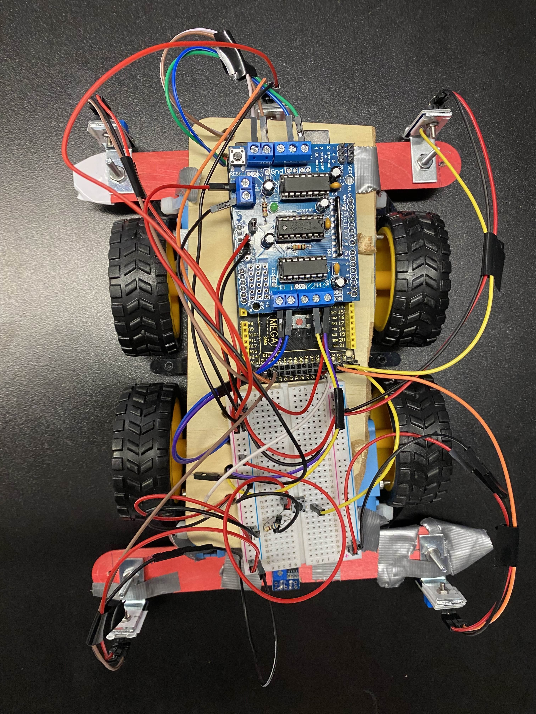
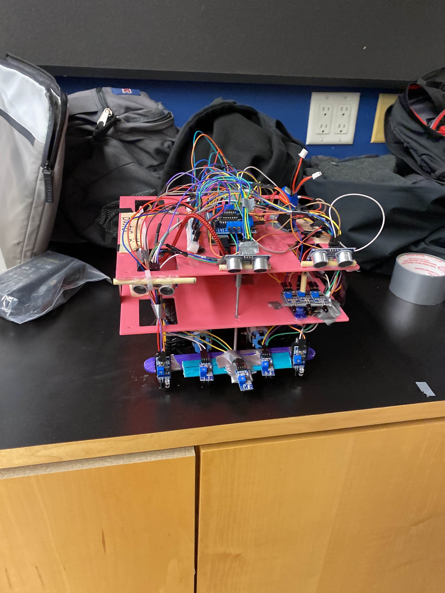

# Buster — The Autonomous Laser Tag Robot

  
  

## Overview

Meet **Buster**, an autonomous laser tag playing robot! What started as a small, cute robot has grown into a hunking beast ready to compete in the laser tag arena.

Built from scratch — no standard starter kit used! Most of Buster's frame and components were salvaged from scrap, giving him unique charm and character. We’re proud to be among the few students who dared to build their robot entirely from the ground up. (TA called our success "Refreshing")

---

## Features

- Fully autonomous laser tag gameplay
- Custom-built frame and parts, mostly repurposed from scrap materials
- Developed from a tiny prototype into a robust competitor
- Clever hardware and software integration for laser tag combat

---

### Parts Used

- Arduino board + motor controller
- Laser tag components (laser and IR sensors, and a servo)
- Motors and chassis parts (custom built with love and duct-tape)
- Sensors for autonomous navigation and laser detection (IR sensors for edge detection, ultra-sonic sensors for object detection, line tracking sensors for path tracing)

*This repo has not been updated to feature the code relevant to the final examination practical where Buster fought in an area (1 on 1) against other bots!

**He pulled off a beatiful snipe in the last 5 seconds of combat to secure me a 4.0 GPA in the course.**
